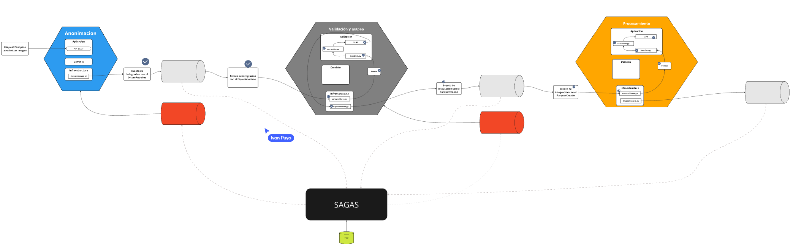

A continuación se presenta el documento solicitado:

---

## **1. Introducción**  

Esta entrega representa la culminación de la Prueba de Concepto del proyecto Salud Tech, orientado a mejorar el procesamiento y anonimización de datos sensibles en el sector salud. En esta fase se consolida la arquitectura basada en microservicios, la integración de mecanismos de orquestación de transacciones distribuidas y el monitoreo de eventos críticos para garantizar la resiliencia del sistema.

El proyecto ha evolucionado significativamente desde entregas anteriores, donde se establecieron los cimientos de la solución y se validaron los flujos básicos de comunicación entre servicios. La presente entrega incorpora avances en la implementación del patrón de sagas, la gestión centralizada de transacciones y la integración con herramientas de despliegue automatizado, permitiendo una operación robusta en entornos productivos.

El objetivo principal de esta Prueba de Concepto es demostrar, mediante experimentos controlados, que la arquitectura propuesta es capaz de gestionar transacciones distribuidas de forma consistente y recuperarse eficientemente ante fallos, garantizando la integridad y disponibilidad de los datos.

---

## **2. Almacenamiento y Transacciones**

### **2.1 Implementación del Patrón de Sagas**

Se ha implementado el patrón de sagas para gestionar transacciones distribuidas, optando por una **coreografía** en la que los servicios se comunican mediante eventos, sin un coordinador centralizado, como broker de mensajes se usa Apache pulsar .

**Servicios involucrados:**
- **Servicio de Anonimización:** El servicio de **anonimacion** es un componente crítico en el proyecto que se encarga de transformar datos sensibles de imágenes DICOM en versiones anónimas. Utiliza un enfoque basado en comandos y mapeo de DTOs para garantizar una separación clara de responsabilidades, lo que mejora la mantenibilidad y escalabilidad del sistema. Además, su robusto manejo de errores y el uso de logs aseguran que se pueda diagnosticar y corregir cualquier incidencia de forma eficiente.
Esta estructura y enfoque permiten integrar la funcionalidad de anonimización de manera consistente dentro del ecosistema general del proyecto, cumpliendo con los requisitos de seguridad y privacidad en el manejo de datos sensibles.

- **Servicio de Validacion y Mapeo:** El servicio de **mapear** actúa como un intermediario que:
Transforma datos externos a estructuras internas (y viceversa),
Ejecuta la lógica de negocio para la creación y consulta de registros "parquet", y
Facilita la comunicación entre la capa de presentación (API) y la capa de aplicación, manteniendo una arquitectura desacoplada y modular.

- **Servicio de Procesamiento:** El servicio **procesamiento** se encarga de procesar la creación de datasets médicos mediante la recepción de datos en formato JSON, su conversión a un DTO y la ejecución de un comando (CreateDatasetMedico) que encapsula la lógica de negocio correspondiente. La separación de responsabilidades mediante el uso de un mapeador y el Command Pattern, junto con un adecuado manejo de errores, asegura una implementación modular, escalable y mantenible dentro de la arquitectura general del proyecto Salud Tech.

**Ejemplo de flujo exitoso:**
1. El Servicio de Anonimización recibe y procesa correctamente los datos.
2. Se emite un evento de éxito, que es captado por el .
3. El Servicio de Base de Datos actualiza el registro correspondiente a un estado "procesado".
4. La saga se cierra con éxito, completando la transacción distribuida.

**Ejemplo de flujo fallido (activación de compensación):**
1. Durante el proceso, se detecta un error en la validación de los datos en el Servicio de Anonimización.
2. Se dispara un evento de error que activa la saga.
3. El Servicio de Base de Datos procede a revertir los cambios (rollback) realizados.
4. Se notifica a través del  que se ha ejecutado la lógica de compensación para restaurar el estado previo.

**Evidencia:**
- **Capturas de logs:** Registros detallados que muestran la secuencia de eventos y la ejecución de la lógica de compensación.
- **Diagrama de flujo:** Esquema gráfico que ilustra el recorrido de la saga, identificando los puntos críticos de compensación.
- **Secuencia de eventos:** Documentación que recoge cronológicamente los eventos emitidos y sus respuestas correspondientes.

### **2.2 Implementación del Saga Log**

El **Saga Log** juega un papel esencial para la implementación del patrón de sagas en el seguimiento y monitoreo de las transacciones distribuidas, permitiendo una trazabilidad completa de cada proceso en el proyecto Salud Tech. Se encarga de:

Iniciar y coordinar la ejecución de las sagas.
Escuchar y procesar eventos de los diferentes servicios, aplicando lógica de compensación cuando sea necesario.
Integrarse con el resto de la arquitectura a través de patrones de comando y eventos, garantizando que las transacciones distribuidas se manejen de manera resiliente y trazable.
Esta estructura y enfoque permiten que el sistema gestione operaciones complejas distribuidas en múltiples servicios, asegurando la consistencia y recuperación en caso de fallos, lo cual es fundamental en entornos donde se manejan datos críticos y sensibles, como en el sector de la salud.

**Propósito y funcionamiento:**
- **Registro centralizado:** Almacena cada evento y cambio de estado de la transacción para facilitar auditorías y diagnósticos.
- **Monitoreo en tiempo real:** Se integra con el coordinador de sagas, permitiendo identificar y actuar ante anomalías en el flujo transaccional.
- **Automatización de compensaciones:** Ayuda a disparar procesos compensatorios de forma automática al detectar inconsistencias o fallos en la ejecución de la saga.

**Evidencia:**
- **Capturas de logs:** Imágenes de los registros del Saga Log que evidencian la captura de eventos y la activación de compensaciones.
- **Fragmentos de código:** Extractos relevantes de la implementación que muestran la integración del Saga Log con el coordinador de sagas.
- **Pantallas de monitoreo:** Visualizaciones en dashboards que permiten supervisar el estado de las transacciones en tiempo real.

---

## **3. Presentación y Despliegue**

### **3.1 Backend For Frontend (BFF)**

Se ha desarrollado un componente **Backend For Frontend (BFF)** que actúa como intermediario entre los clientes y los microservicios internos, simplificando la interacción y mejorando la seguridad y agregación de datos.

**Características principales:**
- **Interfaz unificada:** Consolida múltiples llamadas a servicios internos, proporcionando una única API adaptada a las necesidades del frontend.
- **Lógica de agregación:** Combina y transforma datos provenientes de distintos servicios para ofrecer respuestas optimizadas.
- **Seguridad y validación:** Implementa mecanismos de autenticación y autorización específicos para proteger el acceso a la información sensible.

**Evidencia:**
- **Fragmentos de código:** Ejemplos que demuestran la implementación de rutas, controladores y la agregación de datos en el BFF.
- **Diagrama de la API:** Representación gráfica que muestra la interacción entre el BFF y los servicios subyacentes.
- **Capturas de pantalla:** Imágenes de la interfaz y respuestas obtenidas al interactuar con el BFF.

### **3.2 Despliegue en Plataforma**

El proyecto se despliega utilizando contenedores Docker orquestados mediante **Kubernetes** en la plataforma de **Google Cloud Platform (GCP)**, lo que garantiza escalabilidad, alta disponibilidad y un proceso de despliegue ágil.

**Proceso y herramientas utilizadas:**
- **Docker:** Creación y gestión de imágenes para cada uno de los servicios.
- **Kubernetes:** Orquestación, escalado automático y gestión de la salud de los contenedores.
- **CI/CD:** Automatización de despliegues a través de pipelines configuradas en GitHub Actions y el uso de herramientas como Helm para la gestión de releases.

**Evidencia:**
- **Capturas de pantalla:** Imágenes del entorno desplegado en la consola de GCP, mostrando el estado de los pods y servicios.
- **Herramientas de monitoreo:** Dashboards que evidencian el rendimiento y la estabilidad de la infraestructura.
- **Logs de despliegue:** Registros que confirman la correcta ejecución de la pipeline de integración y despliegue continuo.

### **3.3 Documentación y Postman Collection**

Se ha generado una documentación completa de la API utilizando herramientas como **Swagger** y **Redoc**, y se ha preparado una colección de Postman para facilitar la interacción con el sistema.

**Detalles:**
- **Enlace a la documentación API:** [Swagger API Documentation](#)
- **Enlace a la colección de Postman:** [Postman Collection for Salud Tech](#)
- **Pruebas de funcionalidad:** Se incluyen ejemplos detallados de request-response para demostrar el correcto funcionamiento y la validación de cada endpoint.

---

## **4. Resultados y Refinamiento de la Arquitectura**

### **4.1 Evaluación de los Escenarios de Calidad**

Se han evaluado distintos escenarios para medir la calidad del sistema, enfocándose en aspectos críticos como:

- **Rendimiento:** Análisis del tiempo de respuesta y la capacidad de escalado bajo carga.
- **Disponibilidad:** Verificación del uptime y la resiliencia ante fallos.
- **Consistencia:** Validación de la integridad en las transacciones distribuidas y la efectividad de las compensaciones.

**Resultados:**
- **Cuantitativos:** Datos de pruebas que indican mejoras en tiempos de respuesta, eficiencia en el manejo de errores y una tasa de fallos significativamente reducida.
- **Cualitativos:** Observaciones de los equipos de desarrollo y operaciones que confirman la estabilidad y robustez del sistema.
- **Conclusión:** La implementación del patrón de sagas y la integración del Saga Log han cumplido con la hipótesis del experimento, demostrando una capacidad superior para gestionar transacciones distribuidas y recuperarse de fallos.

### **4.2 Refinamiento del Diseño y Arquitectura**

#### **4.2.1 Diagrama de Mapas de Contexto TO-BE (actualizado)**

Se ha actualizado el diagrama de Mapas de Contexto TO-BE para reflejar los ajustes derivados de la experimentación y la validación del sistema:
- **Justificación de los cambios:** Se han redefinido los límites contextuales y se han optimizado los flujos de comunicación entre servicios para mejorar la cohesión y minimizar acoplamientos innecesarios.
- **Comparación:** Se presenta una comparación entre el diagrama inicial y el refinado, resaltando las mejoras en la modularidad, escalabilidad y resiliencia.
- **Evidencia:** Diagramas actualizados que ilustran de forma clara las nuevas relaciones y dependencias entre los diferentes contextos.

#### **4.2.2 Refinamiento de los Puntos de Vista**

El refinamiento de la arquitectura se ha basado en:
- **Observaciones de la experimentación:** Los experimentos han revelado oportunidades para ajustar la integración y el manejo de eventos, resultando en una arquitectura más robusta.
- **Justificación técnica:** Se han realizado ajustes en la implementación de los servicios y en la orquestación de transacciones, lo que ha permitido una mejora notable en la tolerancia a fallos y la eficiencia operativa.
- **Evidencia:** Diagramas actualizados con anotaciones que explican los cambios realizados y su impacto en la mejora del sistema.

---

Este documento consolida la entrega de la Prueba de Concepto del proyecto Salud Tech, demostrando avances significativos en la gestión de transacciones distribuidas, la implementación de mecanismos de compensación y el refinamiento de la arquitectura para satisfacer los escenarios de calidad definidos.

Si se requiere ampliar algún aspecto o profundizar en evidencias específicas, se pueden proporcionar detalles adicionales y documentación complementaria.